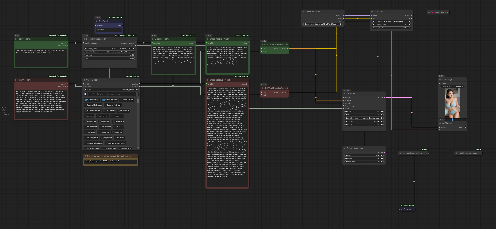
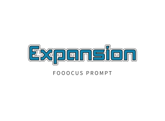

# ComfyUI Fooocus V2 Prompt Expansion Node

**Unleash the Power of Fooocus Prompt Expansion in ComfyUI!**

This custom node brings the acclaimed Fooocus Prompt Expansion V2 directly into your ComfyUI workflows, allowing you to effortlessly generate more detailed and creative prompts for stunning image generation.  Inspired by the simplicity and effectiveness of Fooocus, this node helps you expand your initial prompts into rich, elaborate descriptions that can significantly enhance your image outputs.



> **Effortlessly enhance your prompts and elevate your ComfyUI image generation!**

## Key Features:

* **Fooocus V2 Expansion Algorithm:** Implements the powerful prompt expansion logic from Fooocus, known for its ability to create highly detailed and stylistically rich prompts.
* **Seamless ComfyUI Integration:**  Works as a native custom node within ComfyUI, easily incorporated into your existing workflows.
* **Improved Prompt Detail:** Expands simple prompts into elaborate and nuanced descriptions, leading to more detailed and visually appealing images.
* **Inspired by Fooocus:**  Faithfully adapted from the original [Fooocus](https://github.com/lllyasviel/Fooocus/) project and the [LykosAI - GPT-Prompt-Expansion-Fooocus-v2](https://huggingface.co/LykosAI/GPT-Prompt-Expansion-Fooocus-v2) resource.
* **Ready-to-Use Workflow:**  Includes a complete ComfyUI workflow example (see below) to get you started immediately.

## Get Started:

**1. Installation:**

* **Using ComfyUI Manager (Recommended):**
    * Open ComfyUI Manager.
    * Go to "Install Custom Nodes".
    * Search for `ComfyUI-Fooocus-V2-Expansion` and install it (exists a old version `fooocus-v2-expansion` that should be deleted).
    * **Restart ComfyUI after installation.**

* **Install via Git URL:**
    * Navigate to your `ComfyUI/custom_nodes` directory.
    * Clone this repository using git:
      ```bash
      git clone https://github.com/PanicTitan/ComfyUI-Fooocus-V2-Expansion.git
      ```
    * **Restart ComfyUI after installation.**

**Warning:**

* **GPT-2 Model Download:** The first time you use the "Fooocus V2 Expansion" node, it will download the GPT-2 model (approximately 351MB) required for prompt expansion. This download is necessary and will only happen once. Please be patient while the model is downloaded.

**2. Install Workflow Dependencies:**

* **ComfyUI Manager (Recommended):** If you installed via ComfyUI Manager, it will likely prompt you to install missing dependencies after installation. Click "Install Missing" to automatically install any required Python packages.
* **Manual Installation:** If you installed manually via Git URL, you may need to manually install workflow dependencies [ComfyUI-Easy-Use](https://github.com/yolain/ComfyUI-Easy-Use), [ComfyUI_Comfyroll_CustomNodes](https://github.com/Suzie1/ComfyUI_Comfyroll_CustomNodes) and (optional) [ComfyUI-Crystools](https://github.com/crystian/ComfyUI-Crystools).

**3. Download Essential Models:**

This workflow is designed to work optimally with models and LoRAs commonly used in Fooocus. You can download them here:

* **Main Model (Juggernaut XL v8 - Fooocus Recommended):**
    * [juggernautXL_v8Rundiffusion.safetensors](https://huggingface.co/RunDiffusion/Juggernaut-XL-v8/resolve/main/juggernautXL_v8Rundiffusion.safetensors)
    * Place this model in your `ComfyUI/models/checkpoints` directory.

* **SDXL Offset LoRA (For enhanced style):**
    * [sd_xl_offset_example-lora_1.0.safetensors](https://huggingface.co/stabilityai/stable-diffusion-xl-base-1.0/resolve/main/sd_xl_offset_example-lora_1.0.safetensors)
    * Place this LoRA in your `ComfyUI/models/loras` directory.

**4. Load the Workflow:**

* Download the example workflow JSON file: [Fooocus-ComfyUI.json](https://github.com/PanicTitan/ComfyUI-Fooocus-V2-Expansion/blob/main/Fooocus-ComfyUI.json)
* In ComfyUI, drag and drop the `Fooocus-ComfyUI.json` file onto the interface.
* Ensure you have the required models and LoRA loaded correctly (CheckpointLoaderSimple and LoraLoader nodes in the workflow).

**5. Run and Enjoy!**

* Modify the "Positive Prompt" and "Negative Prompt" text boxes to your liking.
* Click "Queue" to generate your image with Fooocus-expanded prompts.
* Observe the "Expanded Prompt" and "Styled Prompts" nodes to see the prompt expansion in action!

## Credits and Inspiration:

* **Original Fooocus Project:**  [https://github.com/lllyasviel/Fooocus/](https://github.com/lllyasviel/Fooocus/) -  For the innovative prompt expansion technique.
* **LykosAI - GPT-Prompt-Expansion-Fooocus-v2:** [https://huggingface.co/LykosAI/GPT-Prompt-Expansion-Fooocus-v2](https://huggingface.co/LykosAI/GPT-Prompt-Expansion-Fooocus-v2) - For the inspiration and resources for V2 expansion.
* **ComfyUI-Prompt-Expansion (Original Fork):** [https://github.com/meap158/ComfyUI-Prompt-Expansion](https://github.com/meap158/ComfyUI-Prompt-Expansion) -  Base for this adaptation.
* **ComfyUI Manager:** [https://github.com/ltdrdata/ComfyUI-Manager](https://github.com/ltdrdata/ComfyUI-Manager) - For easy installation of custom nodes and dependencies.

**Enjoy using Fooocus V2 Prompt Expansion in ComfyUI!  Feel free to contribute, report issues, or suggest improvements!**

<div align="center">
     
</div>

---
*README.md Generated By AI Gemini 2.0 Flash Thinking ✨*
